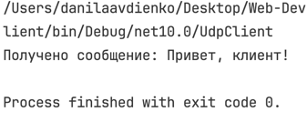
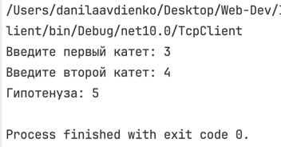
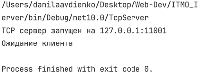
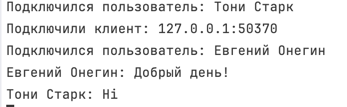
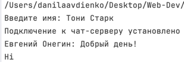
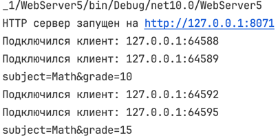
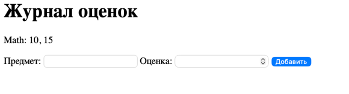

## Практическое задание 1. Обмен сообщениями по UDP

Для обмена сообщениями используется протокол UDP

!!! note 

    UDP не устанавливает постоянное соединение между клиентом и сервером
    Данные передаются отдельными датаграммами

### Используемые пространства имён

```C#
// пространства имен
using System.Net; // ip-адреса и сетевые эндпоинты
```

Классы связанные с обменом данными по сети

```C#
using System.Net.Sockets; // сокеты
```

**Сокет** — это программная точка, через которую приложение отправляет и получает данные по сети

```C#
using System.Text; // для кодировки текста в байты и обратно
```

Нужно так как по сети передаются байты, а не текст/другие данные в чистом виде

`SocketType` задаёт модель передачи данных сокета. Для UDP используется `SocketType.Dgram`, так как данные передаются отдельными датаграммами

### Сервер

??? info "Полный код сервера"

    ```csharp
    using System.Net;
    using System.Net.Sockets;
    using System.Text;

    Socket serverSocket = new Socket(
        AddressFamily.InterNetwork,
        SocketType.Dgram,
        ProtocolType.Udp
    );

    EndPoint serverEndPoint = new IPEndPoint(IPAddress.Loopback, 11000); // здесь создаем эндпоинт (айпи+порт)
    serverSocket.Bind(serverEndPoint);// присваиваем сокет к адресу

    Console.WriteLine("");

    byte[] buffer = new byte[1024]; // список байтов, где будет побайтово храниться полученное сообщение

    EndPoint clientEndPoint = new IPEndPoint(IPAddress.Any, 0); // создаем эндпоинт клиента (заглушка)

    int receivedBytes = serverSocket.ReceiveFrom(buffer, ref clientEndPoint);
    string message = Encoding.UTF8.GetString(buffer, 0, receivedBytes);

    Console.WriteLine($"Received: {message}");

    byte[] response = Encoding.UTF8.GetBytes("Hello, client");

    serverSocket.SendTo(response, clientEndPoint);

    serverSocket.Close();
    ```
!!! note
Метод `ReceiveFrom()` записывает полученные данные в буфер,
возвращает количество полученных байтов и сохраняет endpoint отправителя.

Сервер привязывает UDP-сокет к `127.0.0.1:11000`, получает сообщение клиента и отправляет ответ на адрес отправителя.

### Клиент

??? info "Полный код клиента"

    ```csharp
    using System.Net;
    using System.Net.Sockets;
    using System.Text;

    Socket clientSocket = new Socket(
        AddressFamily.InterNetwork,
        SocketType.Dgram,
        ProtocolType.Udp
    );

    IPEndPoint serverEndPoint = new IPEndPoint(IPAddress.Loopback, 11000);
    byte[] message = Encoding.UTF8.GetBytes("Привет, сервер!");
    clientSocket.SendTo(message, serverEndPoint);

    byte[] buffer = new byte[1024];

    EndPoint remoteEndPoint = new IPEndPoint(IPAddress.Any, 0);
    int receivedBytes = clientSocket.ReceiveFrom(buffer, ref remoteEndPoint);
    string response = Encoding.UTF8.GetString(buffer, 0, receivedBytes);
    Console.WriteLine($"Получено сообщение: {response}");

    clientSocket.Close();
    ```

Клиент отправляет сообщение на endpoint сервера, после чего ожидает ответ и выводит его в консоль.
На примере ниже клиент отправляет сообщение UDP-серверу и получает ответ  
Сервер принимает сообщение клиента и отправляет ответ обратно
### Пример работы

Сервер:


Клиент:


## Практическое задание 2. Вычисления через TCP

Для обмена данными используется протокол TCP.

!!! note
TCP устанавливает соединение между клиентом и сервером перед передачей данных.
В отличие от UDP, TCP гарантирует доставку данных и сохранение порядка байтов.

В данном варианте клиент отправляет серверу два катета прямоугольного треугольника. Сервер вычисляет гипотенузу по теореме Пифагора и возвращает результат клиенту.

### Сервер

??? info "Полный код сервера"

    ```csharp
    using System.Net;
    using System.Net.Sockets;
    using System.Text;

    Socket serverSocket = new Socket(
        AddressFamily.InterNetwork,
        SocketType.Stream, // непрерывный поток байтов
        ProtocolType.Tcp
    );

    IPEndPoint serverEndPoint = new IPEndPoint(IPAddress.Loopback, 11001);

    serverSocket.Bind(serverEndPoint);
    serverSocket.Listen(1); // переводим сокет в режим ожидания TCP-подключений

    Console.WriteLine("TCP сервер запущен на 127.0.0.1:11001");
    Console.WriteLine("Ожидание клиента...");

    Socket clientSocket = serverSocket.Accept(); // принимаем подключение клиента

    byte[] buffer = new byte[1024];
    int receivedBytes = clientSocket.Receive(buffer);

    string message = Encoding.UTF8.GetString(buffer, 0, receivedBytes);

    string[] values = message.Split(' ');

    double a = double.Parse(values[0]);
    double b = double.Parse(values[1]);

    double c = Math.Sqrt(a * a + b * b);

    byte[] response = Encoding.UTF8.GetBytes(c.ToString());

    clientSocket.Send(response);

    clientSocket.Close();
    serverSocket.Close();
    ```

!!! note

    `Listen()` переводит серверный сокет в режим прослушивания входящих TCP-подключений
    `Accept()` принимает подключение и создаёт отдельный сокет для взаимодействия с конкретным клиентом.

После установки TCP-соединения сервер получает два числа, вычисляет гипотенузу и отправляет результат обратно клиенту.

### Клиент

??? info "Полный код клиента"

    ```csharp
    using System.Net;
    using System.Net.Sockets;
    using System.Text;

    Socket clientSocket = new Socket(
        AddressFamily.InterNetwork,
        SocketType.Stream,
        ProtocolType.Tcp
    );

    EndPoint serverEndPoint = new IPEndPoint(IPAddress.Loopback, 11001);

    clientSocket.Connect(serverEndPoint); // устанавливаем TCP-соединение с сервером

    Console.Write("Введите первый катет: ");
    double a = double.Parse(Console.ReadLine()!);

    Console.Write("Введите второй катет: ");
    double b = double.Parse(Console.ReadLine()!);

    string message = $"{a} {b}";
    byte[] data = Encoding.UTF8.GetBytes(message);

    clientSocket.Send(data);

    byte[] buffer = new byte[1024];

    int receivedBytes = clientSocket.Receive(buffer);

    string response = Encoding.UTF8.GetString(buffer, 0, receivedBytes);

    Console.WriteLine($"Гипотенуза: {response}");

    clientSocket.Close();
    ```

!!! note
После коннекта клиентский сокет уже связан с сервером, поэтому для отправки используется `Send`, а не `SendTo` с указанием конкнретного энпоинта


На примере ниже клиент передаёт серверу значения двух катетов  
Сервер вычисляет длину гипотенузы и отправляет результат обратно клиенту


### Пример работы

Сервер:



Клиент:



## Практическое задание 3. Раздача HTML-страницы по HTTP

В данном задании реализуется простой HTTP-сервер. В качестве клиента используется браузер.

!!! note "HTTP поверх TCP"
HTTP работает поверх TCP. TCP отвечает за передачу байтов между клиентом и сервером, а HTTP определяет формат и смысл передаваемых данных

При открытии `http://127.0.0.1:8070` браузер устанавливает TCP-соединение с сервером и автоматически отправляет HTTP-запрос

### Сервер

??? info "Полный код сервера"

    ```csharp
    using System.Net;
    using System.Net.Sockets;
    using System.Text;

    Socket serverSocket = new Socket(
        AddressFamily.InterNetwork,
        SocketType.Stream,
        ProtocolType.Tcp
    );

    IPEndPoint serverEndPoint = new IPEndPoint(IPAddress.Loopback, 8070); 
    serverSocket.Bind(serverEndPoint);
    serverSocket.Listen(1); // бэклог (очередь) из одного

    Console.WriteLine("HTTP сервер запущен на http://127.0.0.1:8070");
    Console.WriteLine("Ожидание запроса...");

    Socket clientSocket = serverSocket.Accept(); // берем следующий из очереди

    byte[] requestBuffer = new byte[1024];
    int receivedBytes = clientSocket.Receive(requestBuffer);

    string request = Encoding.UTF8.GetString(requestBuffer, 0, receivedBytes);
    Console.WriteLine($"Получен HTTP-запрос:\n{request}");

    string html = File.ReadAllText("index.html"); // контент страницы считываем
    byte[] htmlBytes = Encoding.UTF8.GetBytes(html);

    // вручную формируем HTTP-заголовки ответа
    string headers =
        "HTTP/1.1 200 OK\r\n" +
        "Content-Type: text/html; charset=UTF-8\r\n" +
        $"Content-Length: {htmlBytes.Length}\r\n" +
        "Connection: close\r\n" +
        "\r\n";

    byte[] response = Encoding.UTF8.GetBytes(headers + html);

    clientSocket.Send(response);

    clientSocket.Close();
    serverSocket.Close();
    ```


!!! note "HTTP-ответ"
HTTP-ответ состоит из строки статуса, заголовков, пустой строки и тела ответа

У нас сервер формирует следующие заголовки:

```text
HTTP/1.1 200 OK
Content-Type: text/html; charset=UTF-8
Content-Length
Connection: close
```

- `200 OK` — запрос успешно обработан;
- `Content-Type` — сервер передаёт HTML в кодировке UTF-8;
- `Content-Length` — размер HTML-страницы в байтах;
- `Connection: close` — после отправки ответа TCP-соединение закрывается.

Последовательность `\r\n` используется для разделения строк HTTP-заголовков, а `\r\n\r\n` отделяет заголовки от тела ответа


На примере ниже браузер отправляет GET-запрос HTTP-серверу  
Сервер получает запрос и возвращает HTML-страницу, которая отображается в браузере

### Пример работы
HTTP-запрос в терминале сервера:


## Задание 4. Многопользовательский TCP-чат

Для реализации многопользовательского чата используется протокол TCP  
Сервер принимает подключения клиентов, получает их имена и пересылает сообщения между подключёнными пользователями  
В ходе выполнения задания был реализован многопользовательский чат с отдельной обработкой каждого клиента, рассылкой сообщений между пользователями и возможностью выхода из чата

!!! note "Многопоточность"

    После подключения клиента сервер создаёт для него отдельный поток (тред)  
    Основной поток после этого возвращается к `Accept` и продолжает принимать новые подключения  
    В нашем коде каждый клиент обрабатывается независимо, и ожидание сообщения от одного пользователя не блокирует остальных

!!! note "Хранение подключённых клиентов"

    Подключённые пользователи хранятся в `словаре`, где ключ это имя пользователя, а значение - его сокет  
    Поскольку словарь используется сразу несколькими потоками, доступ к нему синхронизируется через `lock`

??? info "Код сервера"

    ```csharp
    using System.Net;
    using System.Net.Sockets;
    using System.Text;

    Socket serverSocket = new Socket(
        AddressFamily.InterNetwork,
        SocketType.Stream,
        ProtocolType.Tcp
    );

    Dictionary<string, Socket> clients = new();
    object clientsLock = new();

    IPEndPoint serverEndPoint = new IPEndPoint(IPAddress.Loopback, 11002);
    serverSocket.Bind(serverEndPoint);
    serverSocket.Listen(10);

    Console.WriteLine("Чат-сервер запущен на 127.0.0.1:11002");
    while (true) // после подключения возвращаемся к аксепт и ждем новое подключение
    {
        Socket clientSocket = serverSocket.Accept();
        Console.WriteLine($"Подключили клиент: {clientSocket.RemoteEndPoint}");
        Thread clientThread = new Thread(() => HandleClient(clientSocket)); // отдельный поток для каждого подключения (клиента)
        clientThread.Start();
    }

    void HandleClient(Socket clientSocket) // принимаем имя клиента, обрабатываем его сообщения, отправляем другим клиентам
    {
        byte[] buffer = new byte[1024];
        int receivedBytes = clientSocket.Receive(buffer);

        string userName = System.Text.Encoding.UTF8.GetString(
            buffer,
            0,
            receivedBytes
        );
        lock (clientsLock) // блокируем доступ к коллекции clients:
        // пока текущий поток находится внутри этого lock,то
        // другие потоки не могут войти в блоки с тем же clientsLock
        {
            clients[userName] = clientSocket;
        }
        Console.WriteLine($"Подключился пользователь: {userName}");
        while (true)
        {
            receivedBytes = clientSocket.Receive(buffer);

            string message = Encoding.UTF8.GetString(
                buffer,
                0,
                receivedBytes
            );
            if (message == "/exit")
            {
                break;
            }
            string fullMessage = $"{userName}: {message}";
            Console.WriteLine(fullMessage);
            byte[] messageBytes = Encoding.UTF8.GetBytes(fullMessage);

            lock (clientsLock) // ставим лок, чтобы во время перебора никто не записался в словарь
            {
                foreach (var client in clients)
                {
                    if (client.Value != clientSocket)
                    {
                        client.Value.Send(messageBytes);
                    }
                }
            }
        }
        lock (clientsLock)
        {
            clients.Remove(userName);
        }
        clientSocket.Close();
        Console.WriteLine($"Пользователь {userName} вышел из чата");
    }
    ```

!!! note "Получение сообщений на клиенте"

    Клиент должен одновременно принимать сообщения от сервера и ожидать ввод пользователя  
    Поэтому получение сообщений выполняется в отдельном потоке, а основной поток используется для отправки

!!! note "Рассылка сообщений"

    Сервер перебирает словарь подключённых клиентов и отправляет сообщение всем сокетам кроме сокета отправителя  
    Благодаря этому сообщение одного пользователя получают остальные участники чата

??? info "Код клиента"

    ```csharp
    using System.Net;
    using System.Net.Sockets;
    using System.Text;

    Socket clientSocket = new Socket(
        AddressFamily.InterNetwork,
        SocketType.Stream,
        ProtocolType.Tcp
    );

    EndPoint serverEndPoint = new IPEndPoint(IPAddress.Loopback, 11002);
    clientSocket.Connect(serverEndPoint);

    // считываем и отправляем серверу имя клиента
    Console.Write("Введите имя: ");
    string userName = Console.ReadLine()!;
    byte[] nameBytes = System.Text.Encoding.UTF8.GetBytes(userName);
    clientSocket.Send(nameBytes);

    Thread receiveThread = new Thread(() => ReceiveMessages(clientSocket));
    receiveThread.Start();
    Console.WriteLine("Подключение к чат-серверу установлено");

    // отправляем сообщения на сервер
    while (true)
    {
        string message = Console.ReadLine()!;
        byte[] messageBytes = Encoding.UTF8.GetBytes(message);
        clientSocket.Send(messageBytes);

        if (message == "/exit")
        {
            break;
        }
    }

    clientSocket.Close();

    void ReceiveMessages(Socket clientSocket) // метод для получения сообщений от других клиентов
    {
        byte[] buffer = new byte[1024];
        try
        {
            while (true)
            {
                int receivedBytes = clientSocket.Receive(buffer);
                if (receivedBytes == 0)
                {
                    break;
                }
                string message = Encoding.UTF8.GetString(
                    buffer,
                    0,
                    receivedBytes
                );
                Console.WriteLine(message);
            }
        }
        catch (SocketException)
        {
        }
    }
    ```

В итоге получили многопользовательский TCP-чат, в котором несколько клиентов могут одновременно подключаться к серверу,
отправлять сообщения всем другим пользователям и завершать соединение с помощью команды `/exit`

### Пример работы программы

На примере ниже к серверу одновременно подключены два клиента с разными именами  
Сообщения одного пользователя передаются другому через сервер





# task 5


## Задание 5. HTTP-сервер с журналом оценок

В этом задании был реализован простой журнал оценок на HTTP-сервере  
Сервер принимает `GET` и `POST` запросы, хранит оценки в словаре и формирует HTML-страницу с текущими записями

!!! note "GET и POST"

    `GET` используется для получения страницы журнала  
    При гет-запросе сервер берет текущие записи из словаря, добавляет их в HTML и отправляет страницу браузеру

    `POST` используется для добавления новой оценки  
    Браузер отправляет серверу название предмета и оценку из HTML-формы, после чего сервер сохраняет их в словарь

!!! note "Тело POST-запроса"

    Заголовки HTTP-запроса отделяются от его тела через `\r\n\r\n`  
    В теле POST-запроса приходят данные формы в формате `subject=Math&grade=10`
    Тело POST-запроса не приходило в первом `Receive`, поэтому пришлось делать еще один `Receive` и дочитывает его

??? info "Код сервера"

    ```csharp
    using System.Net;
    using System.Net.Sockets;
    using System.Text;

    Socket serverSocket = new Socket(
        AddressFamily.InterNetwork,
        SocketType.Stream,
        ProtocolType.Tcp
    );
    Dictionary<string, List<int>> grades = new(); // словарь для записей
    EndPoint serverEndPoint = new IPEndPoint(IPAddress.Loopback, 8071);
    serverSocket.Bind(serverEndPoint);
    serverSocket.Listen(10);
    Console.WriteLine("HTTP сервер запущен на http://127.0.0.1:8071");

    while (true) // цикл обработки подключения и его get/post запросов
    {
        Socket clientSocket = serverSocket.Accept();// принимаем новое TCP-соединение
        Console.WriteLine($"Подключился клиент: {clientSocket.RemoteEndPoint}");
        byte[] buffer = new byte[4096]; // буфер для полученного HTTP-запроса

        int receivedBytes = clientSocket.Receive(buffer);
        string request = Encoding.UTF8.GetString(buffer, 0, receivedBytes);
        if (request.StartsWith("POST") && request.Split("\r\n\r\n")[1] == "") // если POST пришёл без тела, то дочитываем его отдельно
        {
            receivedBytes = clientSocket.Receive(buffer);
            request += Encoding.UTF8.GetString(buffer, 0, receivedBytes);
        }
        
        if (request.StartsWith("GET")) // get-request
        {
            string gradeList = ""; // создаем строку для передачи в html-код
            foreach (var subject in grades)
            {
                gradeList += $"<p>{subject.Key}: {string.Join(", ", subject.Value)}</p>"; // циклом создаем строки из всех записей словаря 
            }
            string html = $"""
                          <!DOCTYPE html>
                          <html lang="ru">
                          <head>
                              <meta charset="UTF-8">
                              <title>Журнал оценок</title>
                          </head>
                          <body>
                              <h1>Журнал оценок</h1>
                              {gradeList}
                              <form method="POST" action="/grade">
                                  <label>Предмет:</label>
                                  <input type="text" name="subject">
                          
                                  <label>Оценка:</label>
                                  <input type="number" name="grade">
                          
                                  <button type="submit">Добавить</button>
                              </form>
                          </body>
                          </html>
                          """;

            byte[] htmlBytes = Encoding.UTF8.GetBytes(html);

            string headers =
                "HTTP/1.1 200 OK\r\n" +
                "Content-Type: text/html; charset=UTF-8\r\n" +
                $"Content-Length: {htmlBytes.Length}\r\n" +
                "Connection: close\r\n" +
                "\r\n";

            clientSocket.Send(Encoding.UTF8.GetBytes(headers + html));
        }
        else if (request.StartsWith("POST")) // обработка пост-запроса
        {
            string body = request.Split("\r\n\r\n")[1]; // получаем тело запроса
            string[] data = body.Split('&'); // получаем отдельно поля subject и grade

            string subject = data[0].Split('=')[1]; // парсим значения полей
            int grade = int.Parse(data[1].Split('=')[1]);

            if (!grades.ContainsKey(subject)) // создаем новую запись при необходимости
                grades[subject] = new List<int>();

            grades[subject].Add(grade);

            clientSocket.Send(Encoding.UTF8.GetBytes( // отправляем браузеру команду заново открыть стартовую страницу
                "HTTP/1.1 303 See Other\r\nLocation: /\r\n\r\n"
            ));
            Console.WriteLine(body);
        }
        clientSocket.Close();
    }
    ```

!!! note "Перенаправление после POST"

    После добавления оценки сервер отвечает кодом `303 See Other` и передает `Location: /`  
    После этого браузер снова делает `GET /` и показывает уже обновленный журнал

В итоге получили простой HTTP-сервер, работающий с двумя методами для добавления оценок и их просмотра

### Пример работы программы


