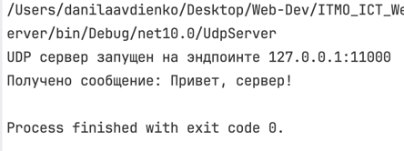
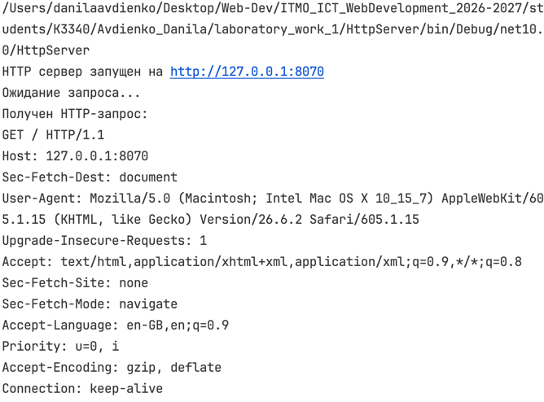

## Практическое задание 1. Обмен сообщениями по UDP

Для обмена сообщениями используется протокол UDP

!!! note
UDP не устанавливает постоянное соединение между клиентом и сервером.
Данные передаются отдельными датаграммами.

### Используемые пространства имён

```C#
// пространства имен
using System.Net; // ip-адреса и сетевые эндпоинты
```

Классы связанные с обменом данными по сети.

```C#
using System.Net.Sockets; // сокеты
```

**Сокет** — это программная точка, через которую приложение отправляет и получает данные по сети.

```C#
using System.Text; // для кодировки текста в байты и обратно
```

Нужно так как по сети передаются байты, а не текст/другие данные в чистом виде.

`SocketType` задаёт модель передачи данных сокета. Для UDP используется `SocketType.Dgram`, так как данные передаются отдельными датаграммами.

### Сервер

??? info "Полный код сервера"

    ```csharp
    using System.Net;
    using System.Net.Sockets;
    using System.Text;

    Socket serverSocket = new Socket(
        AddressFamily.InterNetwork,
        SocketType.Dgram,
        ProtocolType.Udp
    );

    EndPoint serverEndPoint = new IPEndPoint(IPAddress.Loopback, 11000); // здесь создаем эндпоинт (айпи+порт)
    serverSocket.Bind(serverEndPoint);// присваиваем сокет к адресу

    Console.WriteLine("");

    byte[] buffer = new byte[1024]; // список байтов, где будет побайтово храниться полученное сообщение

    EndPoint clientEndPoint = new IPEndPoint(IPAddress.Any, 0); // создаем эндпоинт клиента (заглушка)

    int receivedBytes = serverSocket.ReceiveFrom(buffer, ref clientEndPoint);
    string message = Encoding.UTF8.GetString(buffer, 0, receivedBytes);

    Console.WriteLine($"Received: {message}");

    byte[] response = Encoding.UTF8.GetBytes("Hello, client");

    serverSocket.SendTo(response, clientEndPoint);

    serverSocket.Close();
    ```
!!! note
Метод `ReceiveFrom()` записывает полученные данные в буфер,
возвращает количество полученных байтов и сохраняет endpoint отправителя.

Сервер привязывает UDP-сокет к `127.0.0.1:11000`, получает сообщение клиента и отправляет ответ на адрес отправителя.

### Клиент

??? info "Полный код клиента"

    ```csharp
    using System.Net;
    using System.Net.Sockets;
    using System.Text;

    Socket clientSocket = new Socket(
        AddressFamily.InterNetwork,
        SocketType.Dgram,
        ProtocolType.Udp
    );

    IPEndPoint serverEndPoint = new IPEndPoint(IPAddress.Loopback, 11000);
    byte[] message = Encoding.UTF8.GetBytes("Привет, сервер!");
    clientSocket.SendTo(message, serverEndPoint);

    byte[] buffer = new byte[1024];

    EndPoint remoteEndPoint = new IPEndPoint(IPAddress.Any, 0);
    int receivedBytes = clientSocket.ReceiveFrom(buffer, ref remoteEndPoint);
    string response = Encoding.UTF8.GetString(buffer, 0, receivedBytes);
    Console.WriteLine($"Получено сообщение: {response}");

    clientSocket.Close();
    ```

Клиент отправляет сообщение на endpoint сервера, после чего ожидает ответ и выводит его в консоль.

### Пример работы

Сервер:



Клиент:


## Практическое задание 2. Вычисления через TCP

Для обмена данными используется протокол TCP.

!!! note
TCP устанавливает соединение между клиентом и сервером перед передачей данных.
В отличие от UDP, TCP гарантирует доставку данных и сохранение порядка байтов.

В данном варианте клиент отправляет серверу два катета прямоугольного треугольника. Сервер вычисляет гипотенузу по теореме Пифагора и возвращает результат клиенту.

### Сервер

??? info "Полный код сервера"

    ```csharp
    using System.Net;
    using System.Net.Sockets;
    using System.Text;

    Socket serverSocket = new Socket(
        AddressFamily.InterNetwork,
        SocketType.Stream, // непрерывный поток байтов
        ProtocolType.Tcp
    );

    IPEndPoint serverEndPoint = new IPEndPoint(IPAddress.Loopback, 11001);

    serverSocket.Bind(serverEndPoint);
    serverSocket.Listen(1); // переводим сокет в режим ожидания TCP-подключений

    Console.WriteLine("TCP сервер запущен на 127.0.0.1:11001");
    Console.WriteLine("Ожидание клиента...");

    Socket clientSocket = serverSocket.Accept(); // принимаем подключение клиента

    byte[] buffer = new byte[1024];
    int receivedBytes = clientSocket.Receive(buffer);

    string message = Encoding.UTF8.GetString(buffer, 0, receivedBytes);

    string[] values = message.Split(' ');

    double a = double.Parse(values[0]);
    double b = double.Parse(values[1]);

    double c = Math.Sqrt(a * a + b * b);

    byte[] response = Encoding.UTF8.GetBytes(c.ToString());

    clientSocket.Send(response);

    clientSocket.Close();
    serverSocket.Close();
    ```

!!! note
`Listen()` переводит серверный сокет в режим прослушивания входящих TCP-подключений.

    `Accept()` принимает подключение и создаёт отдельный сокет для взаимодействия с конкретным клиентом.

После установки TCP-соединения сервер получает два числа, вычисляет гипотенузу и отправляет результат обратно клиенту.

### Клиент

??? info "Полный код клиента"

    ```csharp
    using System.Net;
    using System.Net.Sockets;
    using System.Text;

    Socket clientSocket = new Socket(
        AddressFamily.InterNetwork,
        SocketType.Stream,
        ProtocolType.Tcp
    );

    EndPoint serverEndPoint = new IPEndPoint(IPAddress.Loopback, 11001);

    clientSocket.Connect(serverEndPoint); // устанавливаем TCP-соединение с сервером

    Console.Write("Введите первый катет: ");
    double a = double.Parse(Console.ReadLine()!);

    Console.Write("Введите второй катет: ");
    double b = double.Parse(Console.ReadLine()!);

    string message = $"{a} {b}";
    byte[] data = Encoding.UTF8.GetBytes(message);

    clientSocket.Send(data);

    byte[] buffer = new byte[1024];

    int receivedBytes = clientSocket.Receive(buffer);

    string response = Encoding.UTF8.GetString(buffer, 0, receivedBytes);

    Console.WriteLine($"Гипотенуза: {response}");

    clientSocket.Close();
    ```

!!! note
После `Connect()` клиентский сокет уже связан с сервером, поэтому для отправки используется `Send()`, а не `SendTo()` с указанием endpoint.

### Пример работы

Сервер:


Клиент:


## Практическое задание 3. Раздача HTML-страницы по HTTP

В данном задании реализуется простой HTTP-сервер. В качестве клиента используется браузер.

!!! note "HTTP поверх TCP"
HTTP работает поверх TCP. TCP отвечает за передачу байтов между клиентом и сервером, а HTTP определяет формат и смысл передаваемых данных.

При открытии `http://127.0.0.1:8070` браузер устанавливает TCP-соединение с сервером и автоматически отправляет HTTP-запрос.

### Сервер

??? info "Полный код сервера"

    ```csharp
    using System.Net;
    using System.Net.Sockets;
    using System.Text;

    Socket serverSocket = new Socket(
        AddressFamily.InterNetwork,
        SocketType.Stream,
        ProtocolType.Tcp
    );

    IPEndPoint serverEndPoint = new IPEndPoint(IPAddress.Loopback, 8070); 
    serverSocket.Bind(serverEndPoint);
    serverSocket.Listen(1); // бэклог (очередь) из одного

    Console.WriteLine("HTTP сервер запущен на http://127.0.0.1:8070");
    Console.WriteLine("Ожидание запроса...");

    Socket clientSocket = serverSocket.Accept(); // берем следующий из очереди

    byte[] requestBuffer = new byte[1024];
    int receivedBytes = clientSocket.Receive(requestBuffer);

    string request = Encoding.UTF8.GetString(requestBuffer, 0, receivedBytes);
    Console.WriteLine($"Получен HTTP-запрос:\n{request}");

    string html = File.ReadAllText("index.html"); // контент страницы считываем
    byte[] htmlBytes = Encoding.UTF8.GetBytes(html);

    // вручную формируем HTTP-заголовки ответа
    string headers =
        "HTTP/1.1 200 OK\r\n" +
        "Content-Type: text/html; charset=UTF-8\r\n" +
        $"Content-Length: {htmlBytes.Length}\r\n" +
        "Connection: close\r\n" +
        "\r\n";

    byte[] response = Encoding.UTF8.GetBytes(headers + html);

    clientSocket.Send(response);

    clientSocket.Close();
    serverSocket.Close();
    ```


!!! note "HTTP-ответ"
HTTP-ответ состоит из строки статуса, заголовков, пустой строки и тела ответа.

У нас сервер формирует следующие заголовки:

```text
HTTP/1.1 200 OK
Content-Type: text/html; charset=UTF-8
Content-Length
Connection: close
```

- `200 OK` — запрос успешно обработан;
- `Content-Type` — сервер передаёт HTML в кодировке UTF-8;
- `Content-Length` — размер HTML-страницы в байтах;
- `Connection: close` — после отправки ответа TCP-соединение закрывается.

Последовательность `\r\n` используется для разделения строк HTTP-заголовков, а `\r\n\r\n` отделяет заголовки от тела ответа

### Пример работы
HTTP-запрос в терминале сервера:


